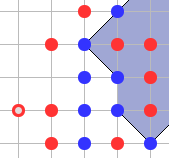

Привычный дизайн точек на zagram.org.
=====

На примере хрома.

1. Установите расширение Tampermonkey. Это расширение для установки и запуска пользовательских скриптов.
2. Зайтите в настройки этого расширения.
3. Добавьте ([+]) следующий скрипт:
```
// ==UserScript==
// @name         Zagram Colors
// @version      0.1
// @author       Vilker
// @match        https://zagram.org/*
// ==/UserScript==

(function() {
    'use strict';

    let x = document.createElement('style');
    x.innerText=`
    img[src="kropkaRed2.gif"],img[src="kropkaBlue2.gif"],
    img[src="kropkaRed1.gif"],img[src="kropkaBlue1.gif"] {
        content:url(data:image/png;base64,iVBORw0KGgoAAAANSUhEUgAAAA0AAAANCAQAAADY4iz3AAAAEUlEQVR42mNkwAkYR6UolgIACvgADsuK6xYAAAAASUVORK5CYII=);
        border-radius: 100%;
        background: #2196f3
    }
    img[src="kropkaRed1.gif"],img[src="kropkaBlue1.gif"] {
        width: 9px;
        height: 9px;
    }
    img[src="kropkaRed2.gif"],img[src="kropkaBlue2.gif"] {
        width: 13px;
        height: 13px;
    }
    img[src="kropkaRed2.gif"],img[src="kropkaRed1.gif"] {
        background: #f44336
    }
    `;
    document.head.appendChild(x);
    console.log('Zagram colors activated')
})();
```
4. Сохраните и обновите страницу в zagram.org:
5. 

